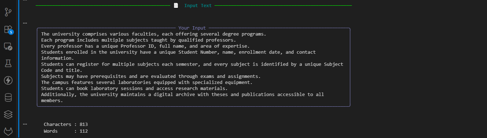
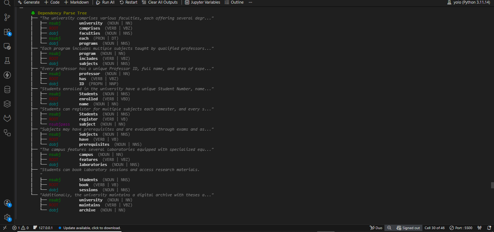
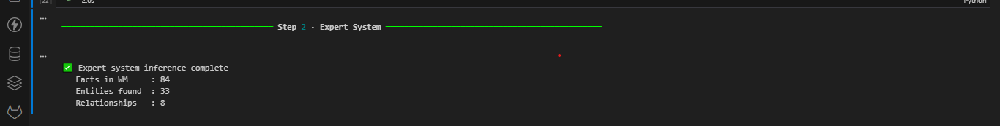
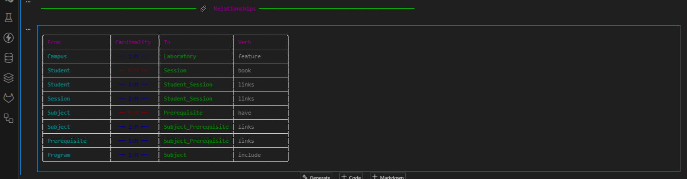

# generate-erd-sql
 Generate ERD &amp; SQL from Natural Language
<div align="center">


# Generate ERD & SQL from Natural Language
### *Type English → Get a full database schema automatically*

[](https://python.org)
[](https://spacy.io)
[](https://github.com/nilp0inter/experta)
[](https://mysql.com)

</div>

---

## 📌 What is this?

This project takes a **plain English description** of any system and automatically generates:

- ✅ A complete **Entity-Relationship Diagram (ERD)**
- ✅ Full **SQL CREATE TABLE** statements with foreign keys & indexes
- ✅ Exported reports as `.sql` · `.json` · `.html`

No manual database design needed — just describe your system in English!

---

## 📸 Screenshots

### 🔹 Input — Plain English Text
> *You type a description like this:*



---

### 🔹 Step 1 — NLP Analysis (Dependency Tree)
> *The system parses every sentence and extracts entities and relationships*



---

### 🔹 Step 2 — Expert System Inference
> *7 rules fire to discover tables, attributes, and relationships*



---

### 🔹 Step 3 — ERD Diagram (Terminal)
> *Each table is displayed as a card with columns, types, and key icons*


---

### 🔹 Step 4 — Generated SQL
> *Full DDL script with CREATE TABLE, FOREIGN KEY, and INDEX*



---

### 🔹 Step 5 — HTML Report Export
> *A beautiful dark-themed report you can open in any browser*


---

### 🔹 Jupyter Notebook — Interactive Mode
> *Run the notebook, enter your text, and watch the full pipeline*


---

## 🧠 How it Works — Simple Explanation

The system has **4 main stages**:

### Stage 1 — Read & Understand the Text (spaCy)
The text is analysed word by word. The system identifies:
- **Nouns** → become database **tables** (e.g. `student`, `professor`)
- **Verbs** → define **relationships** (e.g. `has`, `registers`, `teaches`)
- **Plural/Singular** → determines if the relationship is `1:M` or `M:M`

```
"Students register for multiple subjects"
   ↓            ↓           ↓
 NOUN(plural)  VERB       NOUN(plural)
   ↓                         ↓
 Student ←──── M:M ────→ Subject
```

---

### Stage 2 — Apply Expert Rules (Experta)
A set of **7 rules** fires automatically:

| Rule | What it does |
|------|-------------|
| Rule 1 | Every noun → create a table |
| Rule 2 | "X has Y" → Y becomes a column of X |
| Rule 3 | singular → plural → `1:M` relationship |
| Rule 4 | plural ↔ plural → `M:M` relationship |
| Rule 5 | `M:M` found → auto-create junction table |
| Rule 6 | Known entity (student/professor…) → add standard columns automatically |
| Rule 7 | No `id` column? → add primary key automatically |

---

### Stage 3 — Build the SQL Schema
Each table gets:
- **Primary Key** (`id INT AUTO_INCREMENT`)
- **Columns** with smart types (`VARCHAR`, `DATE`, `FLOAT`…)
- **Foreign Keys** linking related tables
- **Indexes** for performance
- **Timestamps** (`created_at`, `updated_at`)

---

### Stage 4 — Export & Display
- Terminal ER diagram with colours and icons
- `.sql` file ready to run in MySQL
- `.json` file with full schema data
- `.html` dark-themed report

---

## ⚡ Quick Start

```bash
# 1. Clone
git clone https://github.com/RozeraXelil/generate-erd-sql.git
cd generate-erd-sql

# 2. Install
pip install -r requirements.txt
python -m spacy download en_core_web_sm

# 3. Run the notebook
jupyter notebook NLP_DB_Schema_Generator.ipynb

# 4. Or run the terminal script
python nlp_db_system.py
```

---

## 📂 Files

```
generate-erd-sql/
│
├── 📓 NLP_DB_Schema_Generator.ipynb   ← Interactive Jupyter Notebook
├── 📄 README.md
└── 📁 images/                         ← Upload your screenshots here!
    ├── 01_input_text.png
    ├── 02_nlp_analysis.png
    ├── 03_expert_system.png
    ├── 04_erd_diagram.png
    ├── 05_generated_sql.png

```

---

## 📋 Requirements

```
spacy>=3.0.0
experta>=1.9.4
rich>=13.0.0
mysql-connector-python>=8.0.0
```

---

## 👩‍💻 About the Author

<div align="center">


<br/>

| | |
|:---:|:---|
| 🌍 **From** | ROJAVA  |
| 💼 **Role** | Full-Stack Developer & AI Eng Student 🤖 |
| 🧠 **Mission** | Bridging human language and machine logic |
| 💡 **** | `2 + 2 = 1` — ✌🏻 ❤️ 🤍 💛 💚 |

<br/>

>
> ⚡ `2 + 2 = 1` ✌🏻 ❤️ 🤍 💛 💚

<br/>


</div>

---

<div align="center">

**Made by Eng: ROZÊRA XELÎL**

*Rojava-Başûr-Rojhilat-Bakûr *

⭐ Star this repo if it helped you!

</div>
